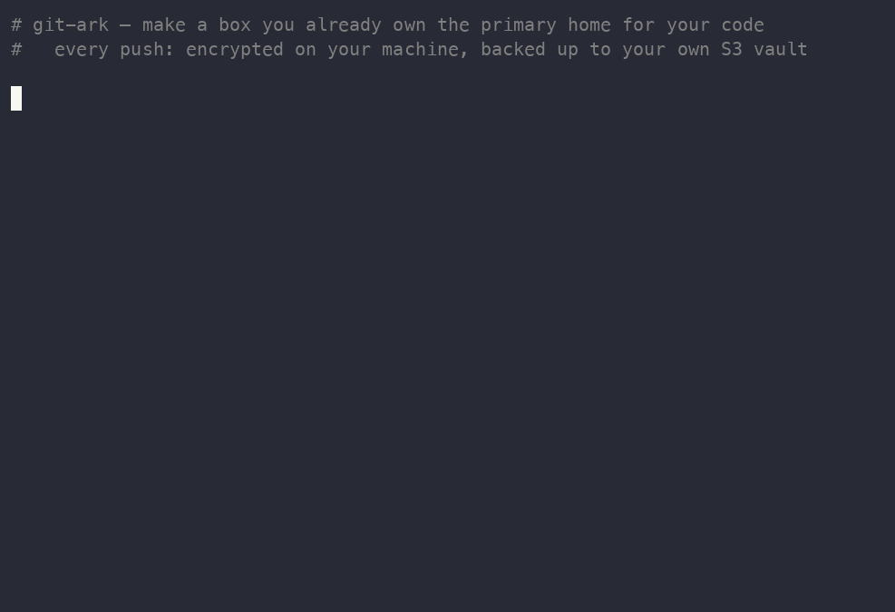

# git-ark

**A write-only backup vault that fronts your own git host — set up and driven entirely from your machine.**

Push to a box you already SSH into — a NAS, a VPS, any Linux host. `git-ark`
auto-creates the repo on first push (no flags, no web UI), and fans every
successful push out to durable, **client-side encrypted** storage in an S3
bucket — AWS S3, or any S3-compatible store (MinIO, Cloudflare R2, Backblaze B2,
…) — plus an **optional** GitHub mirror. The host that stores your code can never
decrypt the backups, and (on AWS) the credentials it holds can only *write* —
never read, list, or delete.

You set the whole thing up **from your own machine**: discover a box on your LAN,
wire it with one command, and push. A dead disk, a stolen box, or a fat-fingered
`rm -rf` can't take everything — and nothing touches the public internet unless
you opt a repo in by name.

<p align="center">
  
</p>

## Install

Installs the **client** — the command you run on your own machine. Hosts get
their binary automatically from `git-ark host add`, so they never need this.

**macOS / Linux** — Homebrew, or a checksum-verified download:

```sh
brew tap boomctl/tap
brew install git-ark
# Homebrew 6+ gates third-party taps — if it refuses, run: brew trust boomctl/tap

# or, without Homebrew:
curl -fsSL https://raw.githubusercontent.com/boomctl/git-ark/main/install.sh | sh
```

**Windows** — Scoop, or PowerShell:

```powershell
scoop bucket add git-ark https://github.com/boomctl/scoop-bucket; scoop install git-ark

# or:
irm https://raw.githubusercontent.com/boomctl/git-ark/main/install.ps1 | iex
```

**With Rust:**

```sh
cargo install git-ark        # build from source (crates.io)
cargo binstall git-ark       # prebuilt release binary, no compile
```

Or grab a binary directly from the
[releases](https://github.com/boomctl/git-ark/releases).

## Quick start

Everything below runs on **your machine** (the client). You never hand-edit
files on the host.

```sh
# 1. One-time: provision the S3 vault from your machine — picks your AWS
#    profile, creates the bucket + write-only key, prints it as export lines.
#    (AWS S3 only; for MinIO/R2 bring your own bucket. See docs/provisioning.md.)
git-ark vault provision --bucket git-ark-vault-example

# 2. If you can't already key-auth into the box, set that up (optional):
git-ark host setup-key user@nas.lan            # generates + copies a key

# 3. Add the host — probes it, fetches the matching git-ark binary for its arch,
#    ships it, wires the forced-command key, writes config + the write-only
#    secret, verifies, and registers it:
export GIT_ARK_HOST_S3_KEY_ID=…  GIT_ARK_HOST_S3_SECRET=…       # the write-only key
git-ark host add nas user@nas.lan \
    --bucket git-ark-vault-example --region us-east-1 \
    --recipient age1…                                          # your age *public* key

# 4. In a repo, route it and push:
git-ark route . --to nas
git push git-ark                                               # → encrypted backup in S3

# 5. Check on your fleet anytime:
git-ark status
```

No toolchain, no cross-compile: `host add` (and `upgrade`) fetch the right host
binary for your client's version straight from the release and verify it against
the release `SHA256SUMS`. Pass `--binary <path>` only for an air-gapped host or a
custom build.

Don't have an age keypair yet? `age-keygen -o ~/.config/git-ark/identity.txt`
prints the `age1…` **public** recipient — keep the private identity off the host;
it's what `git-ark restore` needs.

## Why

The usual advice — "just push to GitHub" — assumes you're ready to put your code
on the internet. Sometimes you're not, but you still need it to survive a
hardware failure. `git-ark` makes *your own* host the primary and gives you real
durability without publishing anything:

- **Auto-create on push.** `git push git-ark:new-project` just works — the bare
  repo is created on first contact.
- **Encrypted, always-on backup.** Every push produces one self-contained
  `git bundle` of the whole repo + history, encrypted with
  [age](https://age-encryption.org) to a key the host never holds, and uploaded
  to your object store (set `s3.endpoint` for anything other than AWS S3).
- **Write-only vault.** On AWS the host's credential is scoped to `s3:PutObject`
  and nothing else; retention is a bucket lifecycle rule, not the host — so a
  compromised host can't wipe your history. (On coarser-token stores like R2 you
  keep confidentiality but lose that hardening — see the security model.)
- **Fan out to several hosts.** `git-ark route <repo> --to nas,ec2` → one
  `git push` lands on every host, each keeping its **own** independent encrypted
  copy. Local-fast plus offsite-durable.
- **Optional GitHub mirror — exactly one, client-managed.** A repo opts in via a
  committed `.git-ark.yml`; the client designates a single host as the mirror,
  keeps the GitHub token only there, and moves/revokes it when you reassign.
- **Verified restore.** `git-ark restore <repo>` pulls from S3, decrypts with
  your private key, and clones it back.

## The control plane

You run git-ark on your machine to manage a fleet of dumb, write-only hosts.
Keys and credentials originate on the client and only their public/least-
privilege parts ever reach a host.

| Command | What it does |
|---|---|
| `git-ark vault provision` | create the S3 vault + write-only IAM key from your machine (AWS S3 only) |
| `git-ark host discover` | scan your LAN for sshable hosts to add |
| `git-ark host setup-key <target>` | generate + copy a client SSH key to a box you can't key-auth into yet |
| `git-ark host add <name> <target> …` | probe → ship binary → install forced-command key → write config/secret → verify → register |
| `git-ark host list` / `host remove <name>` | the host registry |
| `git-ark route <repo> --to <names>` | point a repo's `git push git-ark` at one or more hosts |
| `git-ark mirror set <name>` / `mirror show` | designate / show the single GitHub-mirror host (token follows it, revoked from the old) |
| `git-ark mirror check` | preflight the GitHub token against a repo's `.git-ark.yml` (auth, repo access, `workflow` scope) |
| `git-ark status` | fleet health: reachable? version? disk? which host mirrors? |
| `git-ark upgrade <host>│--all` | fetch the current release binary (or `--binary <path>`) and re-verify |
| `git-ark restore <repo> --identity <key>` | restore from S3 on a trusted machine |

## How it works

Two planes, deliberately separate:

- **Control plane** — your normal interactive SSH. The client uses it to probe,
  wire, upgrade, and query hosts. No new always-on trust surface.
- **Data plane** — a dedicated **forced-command** key `host add` installs, which
  can run *only* git verbs. `git push` rides this.

On the host, git-ark is an SSH forced command — **no daemon**, nothing to keep
running, and your normal login is untouched. When git connects, the shim
resolves (and if needed creates) the bare repo, then hands off to real
`git-receive-pack` / `git-upload-pack`. A `post-receive` hook runs the backup
pipeline synchronously, so progress streams back to your terminal:

```
$ git push git-ark:myproject main
…
remote: bundling myproject …
remote: encrypting 18874368 bytes …
remote: ✓ backup → s3://git-ark-vault-example/git-ark/nas/myproject/latest.age  +  …/history/2026-…Z.age
remote: ✓ main            NAS + encrypted S3 + GitHub
remote: ✓ disk            56.0 TB free (98%)
```

> **Per-repo policy lives in a committed `.git-ark.yml`.** A repo declares which
> branches earn the encrypted S3 backup and, via an optional `github:` block,
> which branches mirror to GitHub. See [`.git-ark.example.yml`](.git-ark.example.yml).
> A repo with no `.git-ark.yml` uses the host's central `backup_refs` and mirrors
> nowhere.

See [docs/DESIGN.md](docs/DESIGN.md) for the full architecture and threat model,
and [docs/deploy.md](docs/deploy.md) for the by-hand setup path that `host add`
automates.

## Security model (short version)

- Backups are **client-side encrypted** with age; the host holds only the
  **public** key and cannot decrypt anything. This holds on **any** backend.
- On AWS the host's credential is scoped to **`s3:PutObject` only** — no
  read/list/delete. Stores with coarser tokens (e.g. Cloudflare R2 has no
  put-only tier) lose that hardening — a compromised host could read/list/delete
  the objects, but they're still age **ciphertext** it can't decrypt.
- The decryption key and any S3 read access live **only** on your trusted
  machine, never on the host.
- The forced-command SSH key can run **only** git verbs; repo paths are sanitized
  against traversal. The GitHub token, if any, lives only on the one designated
  mirror host.

## Contributing

Contributions are welcome — **including AI-assisted and AI-authored
contributions.** This project is built with AI in the loop and embraces it; a
good patch is a good patch regardless of how it was written. See
[CONTRIBUTING.md](CONTRIBUTING.md) for details.

## Acknowledgments

`git-ark` was co-built with [Claude](https://www.anthropic.com/claude)
(Anthropic's Claude Code) working alongside its author.

## License

[Apache-2.0](LICENSE).
